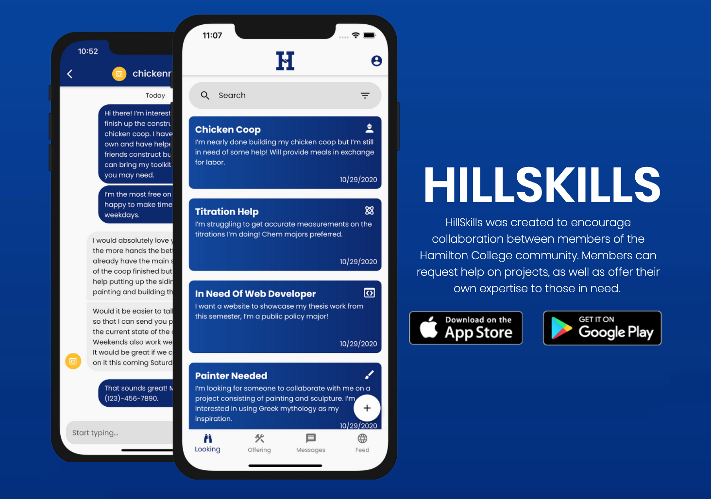
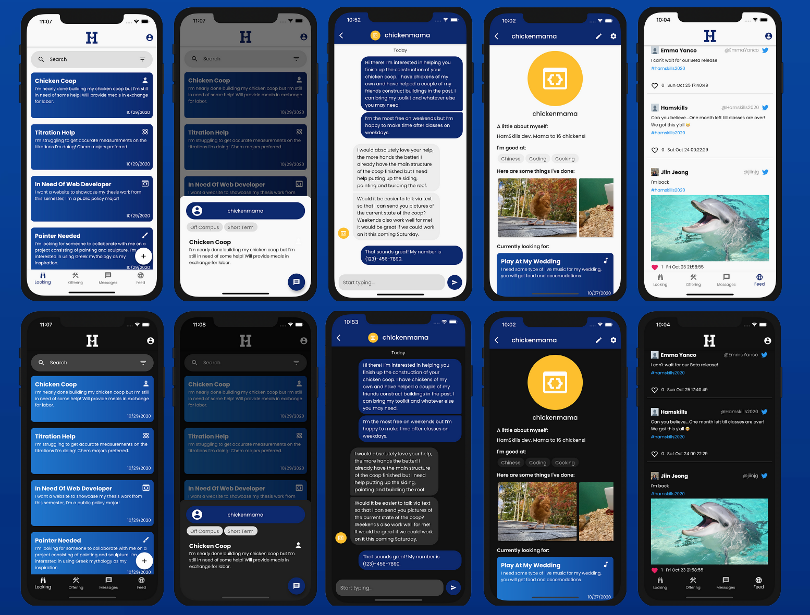

# HillSkills
* **Description:** A cross-platform mobile social-media application intended to promote interdisciplinary collaboration within the Hamilton College community. HillSkills was available on the Apple App Store and Google Play Store (2020-2022). This respository only contains the **lib** code.
* **Collaborators:** Jiin Jeong, Seamus Wiseman, Kirubel Tesfaye
* **Date:** August - December 2020

## App Overview

## App Screenshots

